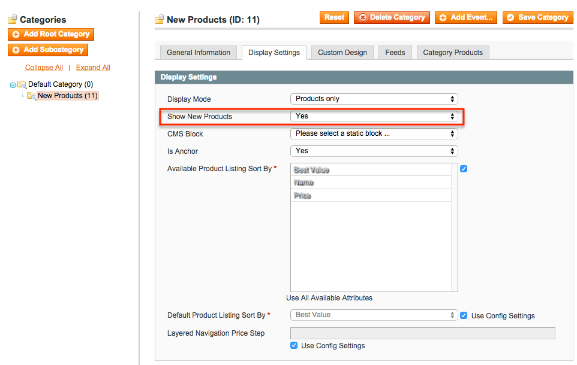
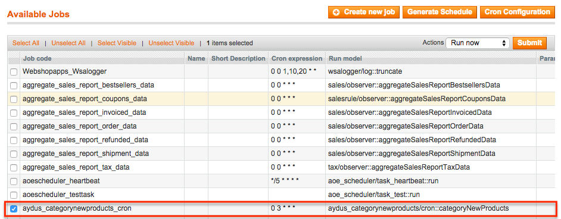

Category New Products
=====================
Cron module to generate new products to categories.

Description
-----------
Select category you wish to show new products. At 3 A.M. cron will run to generate 
new products for the category.

How to use
----------

Upload the extension files to your server. Let the install script run, a new category
attribute `new_products` will be added to your catalog.

Select `Show New Products = Yes` for the 
category you wish to generate new products for:

Make sure cron is working on your site or 
use <a href="https://github.com/AOEpeople/Aoe_Scheduler">Aoe Scheduler</a> to run the 
`aydus_categorynewproducts_cron`:

